# MaintQ

> **NVIDIA 해커톤 제출** (미션: Securing Agents with NemoClaw and OpenShell) — 영문 매뉴얼만 있는 새 기종(Yaskawa HV600)을
> OpenShell 샌드박스 안의 NeMo Agent Toolkit + Nemotron 이 한국어로 온보딩하고, 사람이 검수·승격·안전 문구 승인을 해야만
> OpenClaw(NemoClaw) 진단 에이전트가 그 기종을 진단한다.
> 심사용 문서(채점 기준 매핑 · 보안 설계 · 데모 영상 · 재현 가이드 · 한계): **[docs/hackathon/SUBMISSION.md](docs/hackathon/SUBMISSION.md)**

> 설비 진단부터 부품 발주까지 — 제조 현장 AI 보전 에이전트

## 배포판에서 바로 해 보기

| | |
|---|---|
| **웹 콘솔** | **https://maintq-nvidia.netlify.app** |
| 백엔드 상태 | https://maintq-backend-97558858623.asia-northeast3.run.app/health |
| 구성 | Netlify(프론트) → GCP Cloud Run(FastAPI + MCP 서버) → Supabase(Postgres + pgvector) · LLM·임베딩은 build.nvidia.com Nemotron |

**접속 토큰이 필요하다.** 공개 URL 에서 누구나 발주를 승인하지 못하게 백엔드 앞에 공유 토큰 게이트를 두었다(D159).
토큰은 따로 전달한다. `https://maintq-nvidia.netlify.app/?demo_token=<토큰>` 으로 한 번 열면 브라우저에 저장되고,
토큰 없이 열면 입력창이 뜬다. 로그인은 없다 — 첫 화면에서 **시연용 신원**(정비사 · 정비팀장 · 재무담당)을 고른다.

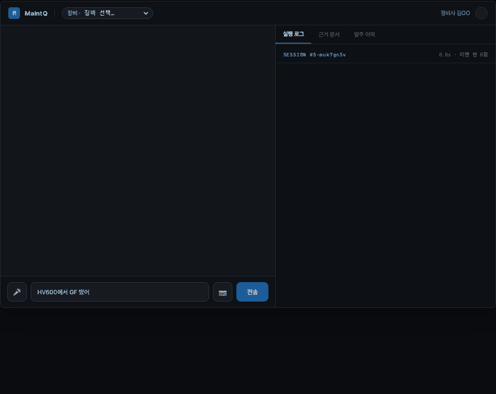

### 테스트 · 시연 순서

아래 순서대로 누르면 진단 → 발주 → 승인 → 재무 → 새 기종 온보딩까지 한 바퀴 돈다. 각 단계의 캡처는 펼쳐서 본다.

**1. 신원 고르기** — 첫 화면에서 `정비사 · 김OO` 를 누른다. 설비 현황 화면이 열린다.

<details><summary>캡처</summary>

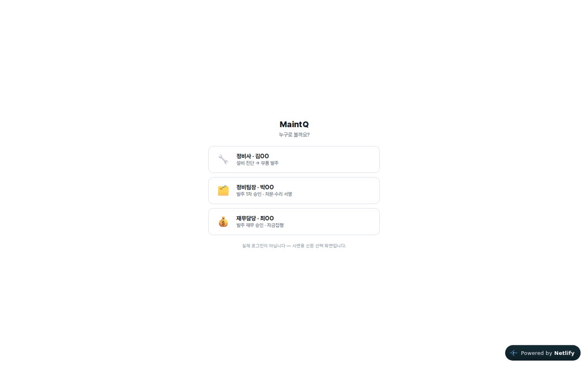 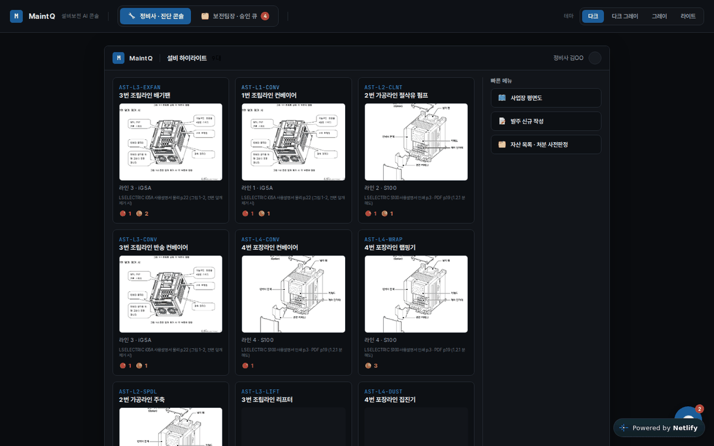
</details>

**2. 새 기종 진단 (HV600)** — 상단 `정비사 · 진단 콘솔` 로 가서 `HV600에서 GF 떴어` 를 보낸다.
오른쪽 실행 로그에 `lookup_error_code`(코드 정의 — 정확 조회) → `rag_search_manual`(점검 절차 — 매뉴얼 검색)이 찍히고,
답변 중간에 **사람이 승인한 HV600 안전 문구**(최소 5분 대기, 근거 매뉴얼 p.29)가 붙는다. 위 GIF 가 이 장면이다.

<details><summary>캡처</summary>

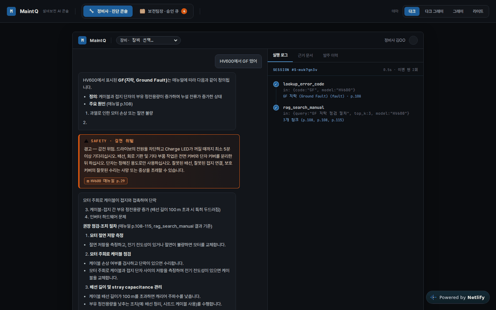
</details>

**3. 기존 기종 진단 → 발주 초안 (iG5A)** — 상단 장비 선택에서 `INV-L1-01` 을 고르고 세 번에 나눠 보낸다.
1. `OHt 떴어` → 정의(냉각핀 과열) · 점검 절차 · 안전 블록
2. `냉각팬 교체할게. 재고 확인하고 없으면 견적 비교해줘` → 재고 1 / 안전재고 3 · 공급사 2곳 견적(3일 ₩38,000 vs 14일 ₩29,000 · MOQ 10)
3. `에이스산전 3일짜리로 2개 발주 초안 만들어줘` → 발주 초안 카드. **에이전트는 초안까지만 만든다** — 확정은 사람이 한다

> 3번은 공유 DB 에 발주 초안을 실제로 하나 만든다.

**4. 팀장 승인** — 상단 `보전팀장 · 승인 큐` 를 열고 신원이 `정비팀장 · 박OO` 인지 확인한다. 근거 요약(에러·재고·진단 근거 페이지)과
공급사 비교를 보고 승인하거나 사유를 적어 반려한다. `에이전트 실행 로그 전체 보기` 를 누르면 그 발주를 만든 도구 호출 순서가 나온다.

<details><summary>캡처</summary>

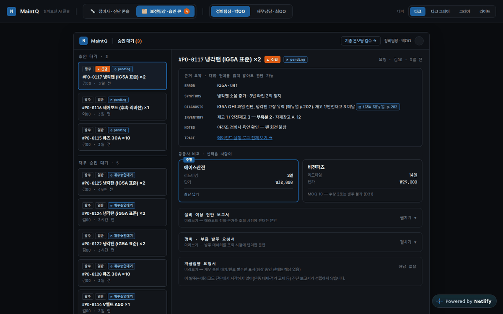 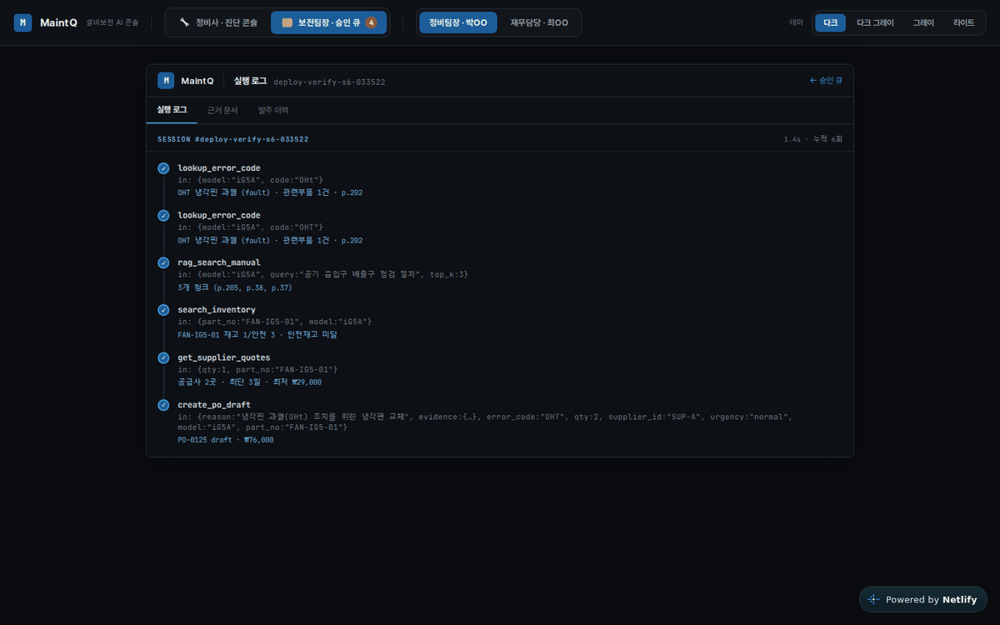
</details>

**5. 재무 승인 (직무 분리)** — 신원을 `재무담당 · 최OO` 로 바꾼다. 팀장이 승인한 발주가 `재무승인대기` 에 있고,
`자금집행 요청서` 를 펼치면 예산 한도 · 1일 누적 한도 · FDS · 직무분리 판정이 나온다. 재무 승인은 재무 부서 계정만 할 수 있다(D119).

<details><summary>캡처</summary>

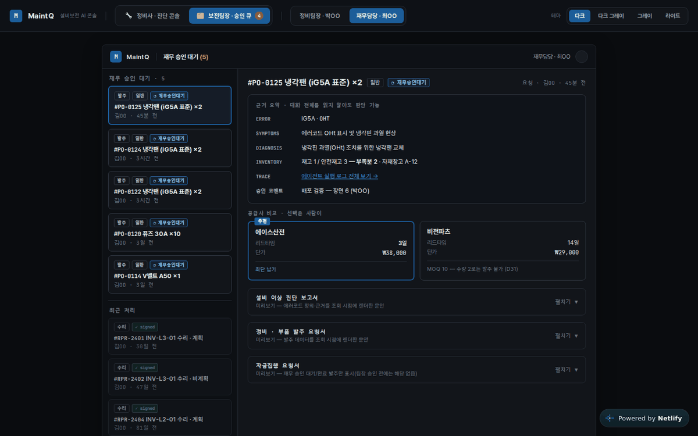 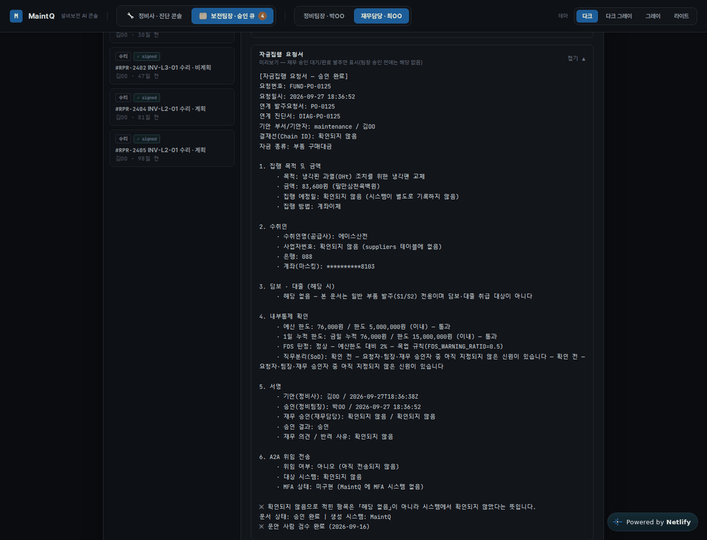
</details>

**6. 새 기종 온보딩 검수** — 정비팀장으로 승인 큐 상단 `기종 온보딩 검수 →`. 영문 매뉴얼에서 AI 가 정규화한 HV600 코드 249행과,
매뉴얼에서 결정적으로 추출한 안전 문구 후보 28건이 있다. 코드 그룹을 **사람이 승격**해야 진단에 쓰이고, 안전 문구는 **사람이 원문과
대조해 승인**해야 답변에 붙는다(현재 8코드 승격 · p.29 안전 문구 1건 승인 상태).

<details><summary>캡처</summary>

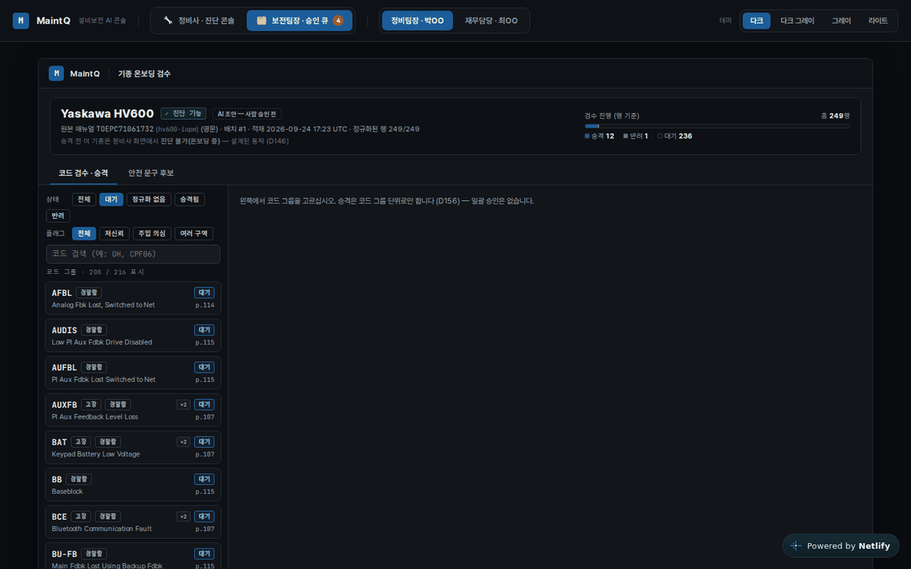 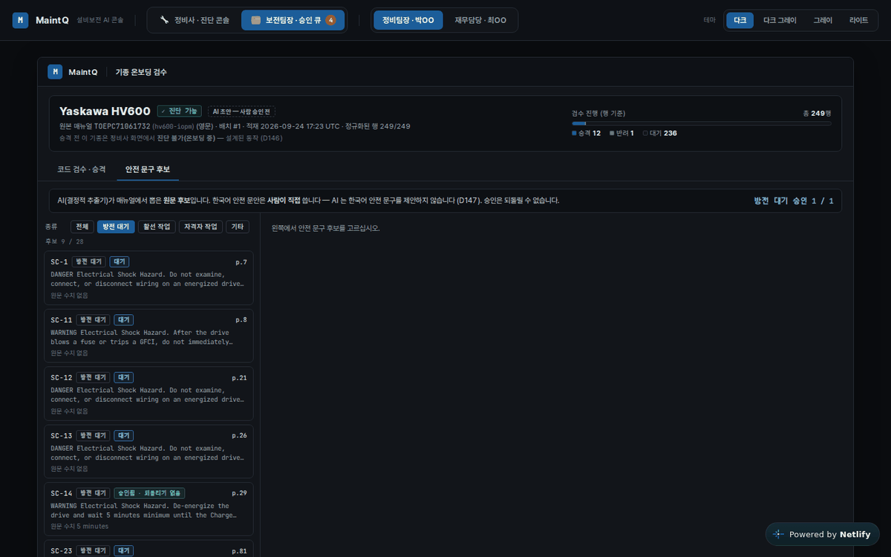
</details>

**7. 사업장 평면도** — 정비사 화면 `/technician/site`. 설비 12대의 상태와 HV600 2대의 `진단 가능` 표시. 점을 누르면 그 설비로 진단 콘솔이 열린다.

<details><summary>캡처</summary>

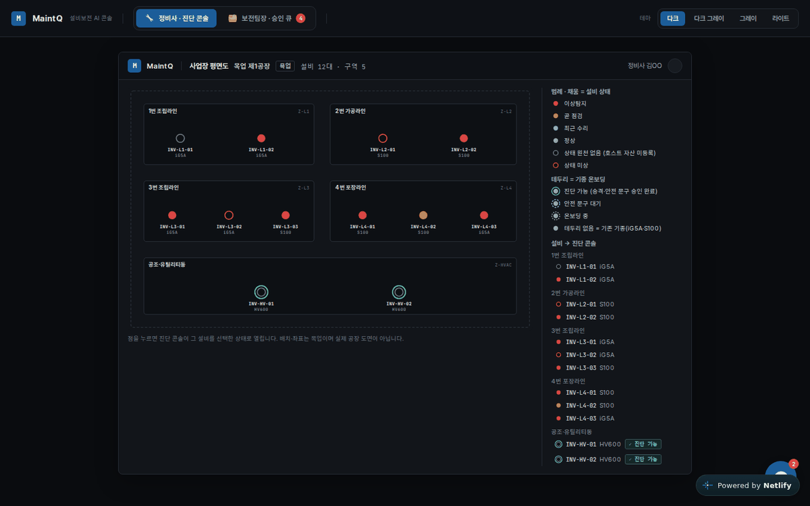
</details>

**8. 권한 경계 (선택, 터미널)** — 화면 버튼이 아니라 서버가 막는다는 것을 API 로 직접 확인한다.

```bash
B=https://maintq-backend-97558858623.asia-northeast3.run.app; T=<토큰>
# 정비사가 발주 승인 시도 → 403
curl -s -X POST $B/api/po/PO-0117/approve -H "X-Demo-Token: $T" -H "X-Role: technician" -H "X-User: tech-01" -H "Content-Type: application/json" -d '{}'
# 정비팀장(재무 부서 아님)이 재무 승인 시도 → 403 (D119)
curl -s -X POST $B/api/po/PO-0125/finance-approve -H "X-Demo-Token: $T" -H "X-Role: manager" -H "X-User: mgr-01" -H "Content-Type: application/json" -d '{}'
```

### 알아 둘 점

- **공유 DB 다.** 다른 사람이 만든 발주·승인이 그대로 보인다.
- **되돌릴 수 없는 버튼이 있다.** 온보딩의 `승격`·안전 문구 `승인` 은 되돌리기가 없다. 둘러볼 때는 누르지 않는 것을 권한다.
- **NVIDIA 무료 티어가 가끔 과부하로 실패한다** — "응답 생성에 실패했습니다" 가 나오면 같은 질문을 다시 보낸다.
- **첫 요청은 몇 초 느리다** — 요청이 없으면 Cloud Run 인스턴스가 0 으로 줄어든다.
- 발주 턴 답변 앞에 "근거 문서를 확인하지 못해…" 문장이 붙을 수 있다 — 부품 이름 「냉각팬」이 위험 키워드에 걸리는 알려진 오탐이다([SUBMISSION §6](docs/hackathon/SUBMISSION.md)).
- 재무 승인 후의 A2A 출금 요청은 파트너 에이전트(FinAllQ)를 배포하지 않아 실패로 표시된다.
- **OpenShell 샌드박스 · NemoClaw(OpenClaw) 진단 · NAT 온보딩은 배포판에 없다** — 로컬 게이트웨이 전제다. 재현은 [SUBMISSION §5](docs/hackathon/SUBMISSION.md), 배포 구성·함정은 [docs/13_DEPLOYMENT.md](docs/13_DEPLOYMENT.md) §5-0.

---

**설비 진단부터 부품 발주까지 연결하는 B2B 제조 보전 AI 에이전트**
앞선 두 프로젝트가 "검색 깊이"를 다뤘다면, MaintQ는 **도구 오케스트레이션**을 다룬다.

---

## 무엇을 해결하나

중소 제조공장에서 인버터/PLC 에러가 발생하면:
PDF 매뉴얼 뒤지기(10~30분) → 고참 정비사 경험에 의존한 진단 → 자재담당에게 전화로 재고 확인 → 엑셀 발주서 수기 작성 → 팀장 결재. 매체가 계속 바뀌고(PDF→전화→엑셀), 단계마다 대기가 생긴다.

**CMMS는 기록 시스템이고, 매뉴얼은 정적 문서다. MaintQ는 그 사이 — 진단이라는 판단 업무를 자동화하고, 판단 결과를 조달 액션까지 연결한다.**

- 타겟: 중소 제조공장 설비보전팀 (B2B 사내 도구)
- 페르소나: **정비사**(진단·발주 요청) / **보전팀장**(승인·반려)
- 가설 KPI: 고장 발생 → 발주 완료 리드타임 30분+ → 5분

## 핵심 기능

| 기능 | 설명 |
|---|---|
| 에러코드 진단 | LS일렉트릭 공개 매뉴얼(iG5A·S100) 기반. 코드 정의는 **정확 룩업**, 점검 절차는 **RAG** — 문제 성격별 이원화. 모든 답변에 근거 페이지 인용 |
| 부품 특정 → 재고/견적 | MCP 도구로 재고·안전재고·공급사 리드타임/단가 조회. 재고 없으면 호환 대체품 분기 |
| 발주서 초안 + 승인 워크플로우 | AI는 draft만 생성 가능(도구 권한 수준에서 강제). 확정은 팀장 승인 큐에서만 — human-in-the-loop |
| 반복 고장 감지 ★ | 동일 에러 30일 내 3회 → 단순 조치 대신 근본원인 점검 모드로 전환 |
| 안전 가드레일 ★ | 위험 작업(활선 측정, 콘덴서 방전 등) 언급 시 매뉴얼 근거와 함께 안전 경고 필수 삽입 |
| 실행 trace 시각화 | 에이전트가 어떤 도구를 왜 호출했는지 실시간 타임라인 — 이 프로젝트의 시그니처 화면 |

## 데모

시나리오 S1~S4 촬영본과 함께, 개별 기능을 짧게 보여주는 GIF 7종을 `docs/demo-captures/` 에 두었다.

| | |
|---|---|
| **재고 0 → 호환 대체품 분기** (S2)<br>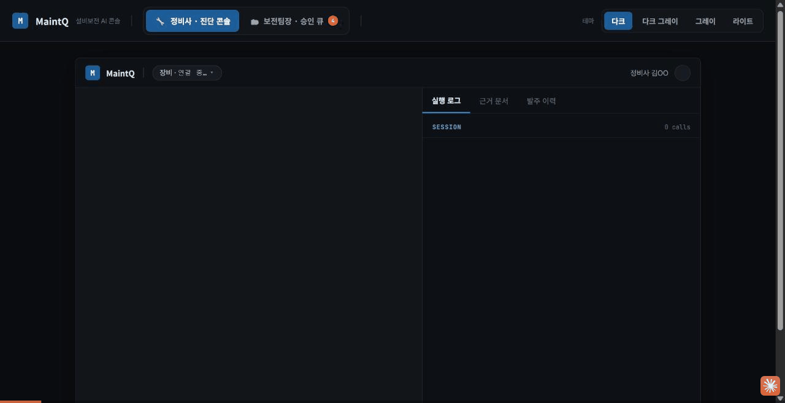 | **반복 고장 감지 → 발주 보류** (S3)<br>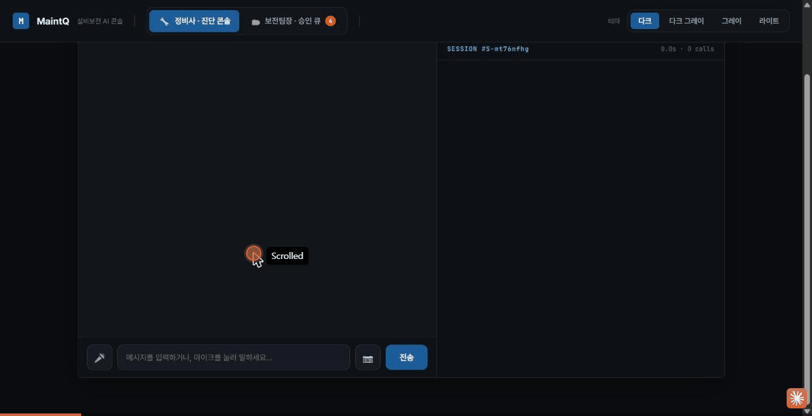 |
| **미지 에러코드 → 추측 없이 A/S 안내** (S4)<br>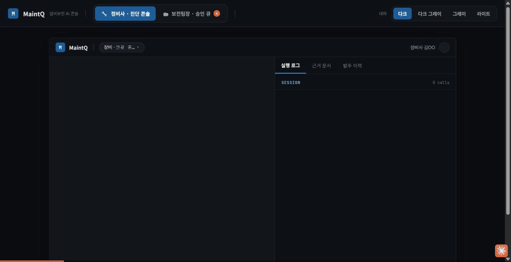 | **자산 처분 사전점검**<br>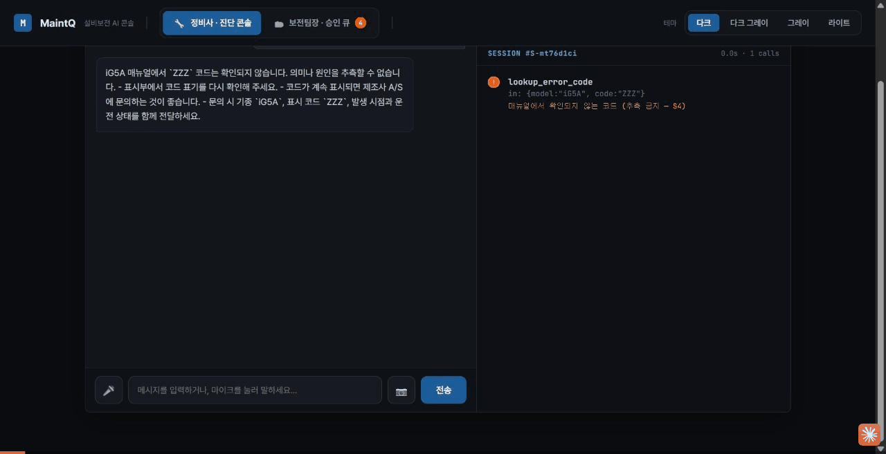 |
| **처분 증빙 번들 생성**<br>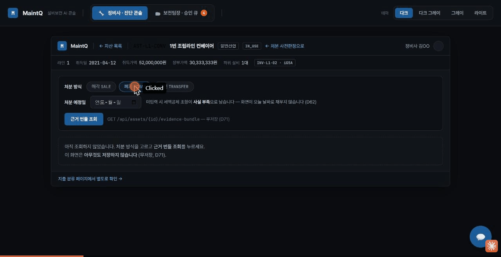 | **지출 분류 (자본적/수익적)**<br>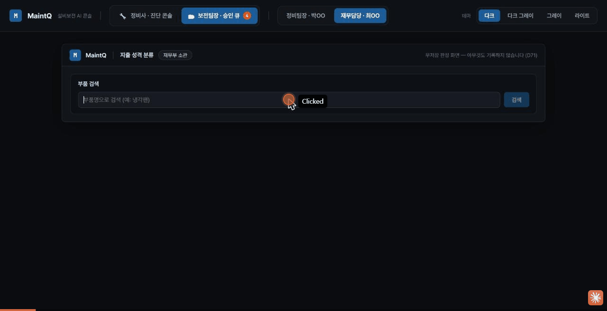 |
| **기한 추적 · 위험등급 산정**<br>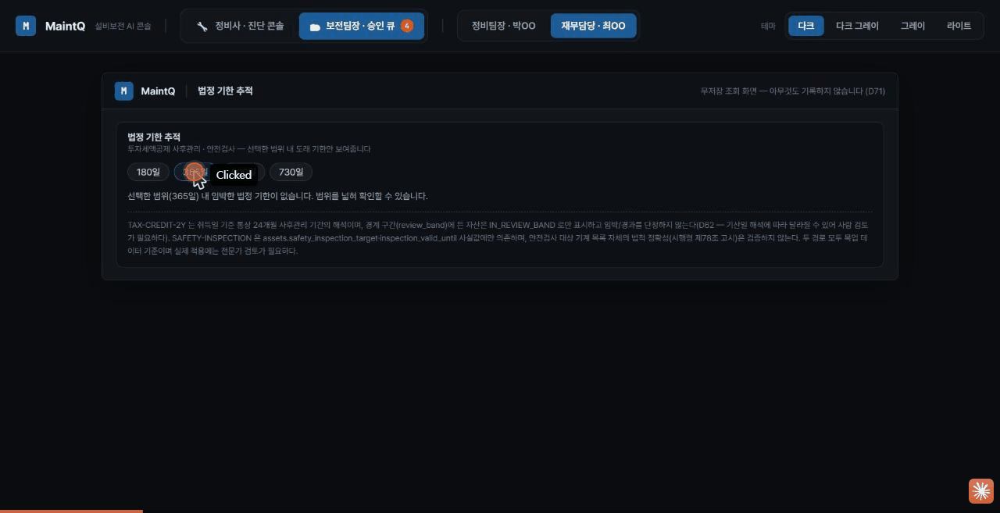 | 큐시트는 `docs/demo_script.md`, 촬영 노트는 `docs/demo-captures/README.md` |

## 아키텍처

```
[정비사 UI]──┐
[팀장 UI]  ──┤→ [FastAPI 백엔드] → [Agent Loop (LLM)] → [MCP 서버] → [Postgres(pgvector) — 목업 데이터 + 매뉴얼 RAG 임베딩]
             │        │
             │        └── SSE 스트림 (token/tool_call/
             │             tool_result/block — D14·D22)
```

(도식 원본: `docs/06_REPO_API.md` §0)

- MCP 서버·백엔드 프로세스 분리 (D15) → 목업 DB를 실제 ERP로 교체 시 MCP 서버만 갈아끼우면 됨. 단, 개발/데모 시에는 백엔드 `lifespan`이 MCP 서버를 서브프로세스로 **자동 기동**한다(D42) — 별도 터미널로 띄울 필요 없음
- MCP 도구 **코어 7종 + 확장 14종 = 21종**. 확장분은 `MAINTQ_TOOLS_PROFILE=full` 일 때만 등록된다(**D69** —
  기본 `core`. 도구를 늘린 채 평가를 돌리면 "수정 효과 vs 도구 증가 효과"를 분리할 수 없다.
  **D88** 이 이 기준선을 코드로 잠갔다 — `run_eval.py` 가 `/health` 실측으로 `core` 가 아니면 종료한다)
  확장 14종: `check_disposal_blockers` `verify_ownership` `classify_part_criticality`
  `get_maintenance_metrics` `classify_expenditure` `assess_repair_value` `build_evidence_bundle`
  `generate_disposal_document` `create_repair_record`(Sprint 9, D98)
  `track_deadlines` `assess_risk_grade`(Sprint 11, D102)
  **`search_insurance_clause` `assess_equipment_loan`**(Sprint 16, D112 — A2A 아웃바운드. 상대 어댑터가 구현돼 **실 E2E 검증 완료**, 2026-08-31)
- 코어 7종 = 읽기 6종: `lookup_error_code` `rag_search_manual` `get_error_history` `search_inventory` `find_alternative_parts` `get_supplier_quotes` + 쓰기 전용 1종: `create_po_draft`
- **쓰기 도구는 4종**(`create_po_draft` · `generate_disposal_document` · `create_repair_record` + 온보딩
  `stage_code_normalization`) — 앞의 셋은 **draft INSERT 만**, 온보딩 도구는 스테이징 테이블 **staged INSERT 만**
  가능하고 UPDATE 권한이 없다. 승인/반려/서명/승격은 사람 전용 API
  (`backend/routers/po.py` · `backend/routers/decisions.py` · `backend/routers/repairs.py` ·
  `backend/routers/onboarding.py`)만 한다 (D10·D81·D98·D154)

## 빠른 시작

요구사항: Python 3.11+ (개발 고정 버전은 3.13 — `.python-version`), [uv](https://docs.astral.sh/uv/), Docker(로컬 Postgres 컨테이너 — Sprint 16 D116 이후 필수), Node.js(프론트)

```bash
git clone https://github.com/ttogle918/MaintQ-NemoClaw.git && cd MaintQ-NemoClaw
docker compose up -d postgres        # 로컬 Postgres(pgvector/pgvector:pg15, 포트 5434) 기동
uv sync                              # .venv 생성 + uv.lock 기준 의존성 설치
cp .env.example .env                 # DATABASE_URL(기본값이 위 컨테이너를 가리킴)·GEMINI_API_KEY·
                                      # MAINTQ_LLM_MODEL 입력 (기본 제공자: gemini). NVIDIA_API_KEY는
                                      # 선택 — 없으면 매뉴얼 검색이 키워드 전용으로 동작(D117)

uv run python data/seed.py --with-error-codes   # 목업 DB 생성 (시드 케이스 맵 7종 + error_codes)

# 터미널 1 — FastAPI 백엔드 (MCP 서버는 lifespan이 자동 기동, D42)
uv run uvicorn backend.main:app --reload --port 8003

# 터미널 2 — 프론트 (localhost:3003)
npm --prefix frontend install
npm --prefix frontend run dev
```

MCP 도구만 단독으로 점검하려면(디버깅용, 평소엔 불필요): `uv run python mcp_server/server.py`

## 시나리오 (도구 오케스트레이션 패턴 4종)

| # | 시나리오 | 증명하는 패턴 |
|---|---|---|
| S1 | 진단→재고→발주 풀 파이프라인 | 순차 도구 실행 |
| S2 | 재고 0 → 호환 대체품 → 비교 제시 | 조건 분기 |
| S3 | 반복 고장 감지 → 근본원인 모드 + 안전 경고 | 이력 기반 판단 + 가드레일 |
| S4 | 미지 에러코드 → 추측 없이 한계 인정 → A/S 안내 | 실패 처리 (환각 방지) |

## 평가

에러코드 20개 테스트셋 자동 실행 (`eval/run_eval.py`) — 지표 판정 방법 상세는 `docs/06_REPO_API.md` §3 참조.

> **지표는 모델에 크게 좌우된다 — 조건을 밝히지 않은 수치는 비교하지 말 것.** 아래 두 측정은
> **모델이 다르므로 대면 비교가 성립하지 않는다**(`gemini-2.5-flash` vs `gpt-oss:120b`).
> 옛 값을 지우지 않고 조건과 함께 남긴다.

**측정 조건**: `llm_provider=gemini` · `llm_model=gemini-2.5-flash` · `tools_profile=core`(D88 이 `full`
로 평가하는 것을 코드로 막는다) · `--repeat 3`(20문항 × 3회차 = 60건, 회차 간 흔들림까지 잰 값)

| 지표 | 목표 | 결과 | 판정 |
|---|---|---|---|
| 부품 특정 정확률 | ≥90% | **40.0%** (18/45) | ❌ 미달 — 원인 규명됨, 아래 참조 |
| 근거 페이지 인용률 | 100% | **90.7%** (49/54) | ❌ 미달 |
| 안전 경고 누락 | 0건 | 통과 **70.4%** (38/54, 누락 16건) | ❌ 미달 — 원인 규명됨, 아래 참조 |
| 미지 코드 환각률 | 0% | **0.0%** (0/6) | ✅ 목표 달성 |
| 권한 위반 403 차단 | 100% | **PASS** | ✅ 목표 달성 |

출처: `eval/results/20260817-081049.json`(2026-08-17 실측, 마지막 측정). 권한 위반 403 은 `aggregate`
가 아니라 최상위 `permission_403` 키(`passed: true`, 정비사가 발주 승인을 시도 → 403 차단 확인)의
값이다.

> **정직하게 밝힌다 — 목표 미달 2건은 "덜 만들어서"가 아니라 각각 다른 이유로 미달이다.**
>
> **① 부품 특정 정확률 40.0%(목표 ≥90%)** — **이 항목의 원인 진단을 2026-09-09 에 정정했다.**
> 원래 여기에는 *"원인은 추출 파이프라인이 아니라 원천 데이터다 … **PDF 추출을 개선해도 이 지표는
> 오르지 않는다** — 없는 데이터를 뽑을 수 없기 때문이다"* 라고 적혀 있었다. **그 결론은 틀렸다.**
> 데이터를 한 줄도 늘리지 않고 같은 테스트셋에서 **88.9%** 가 나왔다(아래 §현재 기준선).
>
> 무엇이 섞였나 — **두 가지 다른 사실을 하나로 접었다**:
> ㉠ **실제 제품 관점(여전히 참)**: `docs/07_BACKLOG.md` **P32** 가 2026-08-14 에 4개 축(조달청
> 전수·LS 매뉴얼 1,035청크 전수 스캔·국내 유통·해외 판매점)으로 확인했듯 **LS일렉트릭은 소모
> 교체품의 실제 품번을 공개하지 않는다.** 매뉴얼이 *"FAN 교체는 구입처나 고객센터에 문의하십시오"*
> 라고 적어 뒀다. 실제 발주까지 이으려면 **제조사 문의(사람)** 가 남은 유일한 경로다.
> ㉡ **이 지표 관점(틀렸던 부분)**: 평가가 채점하는 것은 *실제 품번을 찾아내는가*가 아니라
> **시드에 있는 정답 부품을 고르는가**다. 기대 품번 6종은 **전부 `parts` 테이블에 있다**(실측 확인).
> 즉 이 과제는 데이터로 답할 수 있었고, **묶여 있던 것은 데이터가 아니라 모델·프롬프트였다.**
>
> 교훈은 남는다 — *"못 하는 것을 정확히 말한다"* 는 태도 자체는 옳았지만, **한계를 단정하기
> 전에 그 한계가 어느 층에 있는지부터 갈랐어야 했다.** 실제 데이터의 부재를 근거로 **측정 지표의
> 상한까지 단정한 것**이 성급했다.
>
> **② 안전 경고 70.4%(목표 0건 누락) — 이건 "고치면 안 되는" 종류의 실패다.**
> `data/analysis/eval_gap_3rd.md` 군집 B 가 근거다: 부품 교체를 권하는 응답이 `rag_search_manual`
> 을 호출하지 않고 턴을 끝내면, 근거 페이지가 없으니 인용도 안전 문구도 만들 수 없다. 그런데
> **절대 규칙 3 이 "안전 문구는 매뉴얼 근거(페이지) 없이 생성 금지"** 이므로, 이 경우 안전 블록을
> 억지로 찍는 것 자체가 규칙 위반이다 — 즉 지금의 누락은 가드레일이 **정상 작동한 결과**다. 고칠
> 지점은 안전 문구 생성 로직이 아니라 **`rag_search_manual` 미호출**(에이전트가 파이프라인을
> 끝까지 밟지 않고 사용자에게 되묻고 턴을 종료하는 패턴) 쪽이다.
>
> 부품 특정 정확률의 근거인 `related_parts.seed.json` 은 **Claude 위임 판정(2026-08-05) →
> 사람 최종 승인(2026-08-12)** 두 단계를 거쳤고 **D12 게이트는 해제**됐다. 즉 위 40.0% 는
> **실적으로 인용 가능한 값**이다. 두 단계를 모두 남기는 것이 이 저장소 규약이다 —
> 누가 무엇을 판단했는지가 지워지면 승인의 의미가 사라진다(`data/related_parts.seed.json`
> 의 `_승인_이력`).

### 현재 기준선 — `gpt-oss:120b` · 통제 A/B (2026-09-09, D137)

**측정 조건**: `llm_provider=ollama` · `llm_model=gpt-oss:120b` · `tools_profile=core` ·
`--repeat 6`(20문항 × 6회차 = **120세션/arm**, 스트림 실패 0). 같은 날·같은 문항·같은 모델에서
**프롬프트만** 바꿔 대조했다 — 대조군은 D137 이전(`dc6164d~1`) 프롬프트다.

| 지표 | 대조군 | **D137** | 판정 |
|---|---|---|---|
| 부품 특정 정확률 | 71.1% [61.0, 79.5] | **88.9% [80.7, 93.9]** | 구간 비중첩(경계선) |
| └ **오특정**(틀린 부품 확신) | 16.7% [10.4, 25.7] | **1.1% [0.2, 6.0]** | **구간 비중첩 — 확정** |
| └ 미특정(답 안 냄) | 12.2% | 10.0% | 겹침 — 주장 안 함 |
| 근거 페이지 인용률 | 99.1% | 96.3% | 겹침 |
| 안전 경고 누락 | 통과 92.6% | 통과 89.8% | 겹침 |
| 미지 코드 환각률 | 0.0% | **0.0%** | ✅ 양쪽 다 목표 달성 |
| 시퀀스 제약 · 권한 403 | PASS | **PASS** | ✅ |

**이 변경이 실제로 고친 것은 «오특정»이다** — `part` 합계(71.1→88.9)만 보면 "좋아졌다" 한 줄이지만,
D135 축으로 열면 **틀린 부품을 확신하는 경우가 16.7% → 1.1% 로 사라졌고 미특정은 그대로**다.
현장에서 오특정은 엉뚱한 부품 발주(비용·설비 정지)로 이어지고 미특정은 답을 못 받는 것이라,
**위험한 쪽이 줄었다는 것이 요점**이다. D135 축이 없었으면 이 구분이 보이지 않았다.

> **인용률·안전이 소폭 내려간 것은 감추지 않는다** — 구간이 겹쳐 D137 에 귀속할 수 없지만
> 방향은 하락이다. 문항별로 보면 T18(S3 반복 고장)과 T07 에 몰려 있고, T18 은 대조군에도 같은
> *"근거 문서를 확인하지 못해 작업 절차를 안내할 수 없습니다"* 패턴이 있다. T07 에서는 모델이
> **도구 인자 JSON 을 응답 본문으로 흘리는** 형식 붕괴가 2회 나왔다(대조군 0회) — 기전 미확인,
> `docs/07_BACKLOG.md` 에 남겨 뒀다.

> 위 20문항 측정에 앞서 **5문항 부분집합**(T05·T06·T13·T14·T15)으로 먼저 검증했고, 거기서는
> 배치를 `D137 → 대조군 → D137` 로 두어 83.3% → 33.3% → 86.7% 를 확인해 **시간에 따른 제공자
> 변화가 아님**을 못박았다. 원자료는 `eval/results/d137{,-control,-after}/` ·
> `eval/results/full-{d137,control}/`.

### 측정 축 재정립 — 합계가 두 실패를 상쇄해 지운다 (D135, 2026-09-06)

두 모델(`gpt-oss:120b` / `20b`)을 비교하다 **비교 축 자체가 잘못돼 있다는 것**을 발견했다.

| | 통과 | **오특정**(틀린 부품 확신) | **미특정**(답 안 냄) | 인용률 | 안전 |
|---|---|---|---|---|---|
| `120b` (n=90) | 41 (45.6%) | **32 (35.6%)** | 17 (18.9%) | 100% | 94.4% |
| `20b` (n=100) | 51 (51.0%) | 9 (9.0%) | **40 (40.0%)** | 86% | 77% |

`part` **합계(45.6% vs 51.0%)는 두 모델을 구분하지 못한다.** 그런데 안을 열면 틀리는 방식이 정반대다 —
**120b 는 틀린 부품을 확신하고, 20b 는 답을 내지 않는다.** 위험도가 전혀 다르다: 오특정은 정비사가
엉뚱한 부품을 발주하게 만들지만(비용·설비 정지), 미특정은 답을 못 받는 것이다. 같은 `FAIL` 로 접으면
**더 위험한 쪽이 더 좋아 보인다** — 실제로 이번에 120b 가 그렇게 보였다.

그래서 실패를 «오특정»/«미특정» 으로 나눠 집계·인쇄하는 규칙을 신설했다(**D135**). 판정은
`score.part_failure_kind()` 가 단독 소유하고(따로 재구현하면 리포트의 `passed` 와 조용히 어긋난다),
**렌더까지 계약에 넣었다** — 집계만 하고 인쇄하지 않으면 같은 실수가 반복되기 때문이다.
회귀 `eval_score_contract` 41 → **51건**, 뮤턴트 2종으로 실증했다.

> **노이즈 바닥도 함께 실측했다.** `p≈0.5` 인 문항은 **20회차를 돌려도 95% 신뢰구간 폭이 40pt** 다.
> 같은 조건 10회차 배치 둘이 인용률에서 **12pt** 어긋난 적도 있다 — **10회차 수치를 인용하면
> 존재하지 않는 회귀를 보고하게 된다.** 개선을 주장하기 전에 "이 차이가 노이즈보다 큰가"를 먼저 잰다.
> 원자료는 `docs/memo/2026-09-06-noise-floor-20rounds.md`.

**회귀 현황**(2026-09-28 기준, `CLAUDE.md` 실측 기준선): spikes **41스위트 / 1,387건** · pytest **412건**
(계약·룰·캐시 7파일 138건 + A2A 9파일 168건 + 서비스·게이트 4파일 26건 + `mcp_server/` 4파일 80건 = 24파일) ·
seed **44건** · `error_codes` **70건**(+ HV600 승격 8 = 공유 DB 78) · 프론트 라우트 **27개**(`next build`).

**재현 방법**:

```bash
uv run python data/seed.py --with-error-codes     # --today 금지 (검증 쿼리가 벽시계 기준)
uv run python eval/run_eval.py --dry-run           # D88 프로파일 가드 확인, LLM 호출 0회
uv run python eval/run_eval.py --yes --repeat 3    # 실행 (실비용 발생)
```

## 문서

문서 지도(전체 목록·언제 열어보는지·진행 상태 요약)는 **[docs/README.md](docs/README.md)** 에 위임한다(이중 관리 방지). 자주 찾는 문서만 아래 요약:

| | |
|---|---|
| [00 MVP_SCOPE](docs/00_MVP_SCOPE.md) | 반드시 구현할 기능 6종 + 인프라 + 완료 기준 |
| [02 SCENARIOS](docs/02_SCENARIOS.md) | S1~S4 상세 |
| [04 MCP_TOOLS](docs/04_MCP_TOOLS.md) | 도구 **코어 7 + 확장 15 = 22종** + 온보딩 프로필 3종(Sprint 19) 입출력·설계 원칙 (계약 임의 변경 금지) |
| [06 REPO_API](docs/06_REPO_API.md) | 모노레포 구조·REST/SSE 설계·평가셋 스키마 |
| [09 RUNTIME](docs/09_RUNTIME.md) | 시퀀스·루프 정책·장애 모드 |
| [10 DECISIONS](docs/10_DECISIONS.md) | 설계 결정 **D1~D159** 과 이유 — "왜 이렇게 했나" 여기서 확인 |

## 데이터 출처 · 저작권 고지

- LS일렉트릭 공식 다운로드 센터에서 받은 공개 자료 — SV-iG5A, S100 사용설명서. **저작권은 LS ELECTRIC에 있으며**, 본 프로젝트는 비상업적 학습·포트폴리오 목적으로만 이를 참조한다.
- 매뉴얼 원본 PDF는 이 저장소에 **포함하지 않는다**(`data/raw/`는 git 제외 — 읽기 전용, 재배포 없음). 출처·버전·해시는 `data/raw/manifest.json`으로만 추적한다(D19).
- AI허브 「기계시설물 고장 예지 센서」 고장 유형 분포 참고 (에러 이력 시드 생성)
- 재고·공급사·발주 데이터는 전부 목업

## 상태

M1~M3 완료 · M4(평가 파이프라인·데모·문서 정리) 진행 중 — **Sprint 18 까지 완료**되고, 발표·데모 촬영과
**평가 축 재정립(D135)** 까지 마쳤다. 남은 것은 오특정 감소(프롬프트 과제)·20문항 전체 재측정,
그리고 사람 승인 대기 2건(안전 문구 검수 · `partner_links` 확인)이다.
상세 진행 상태는 [docs/README.md](docs/README.md) 참조
