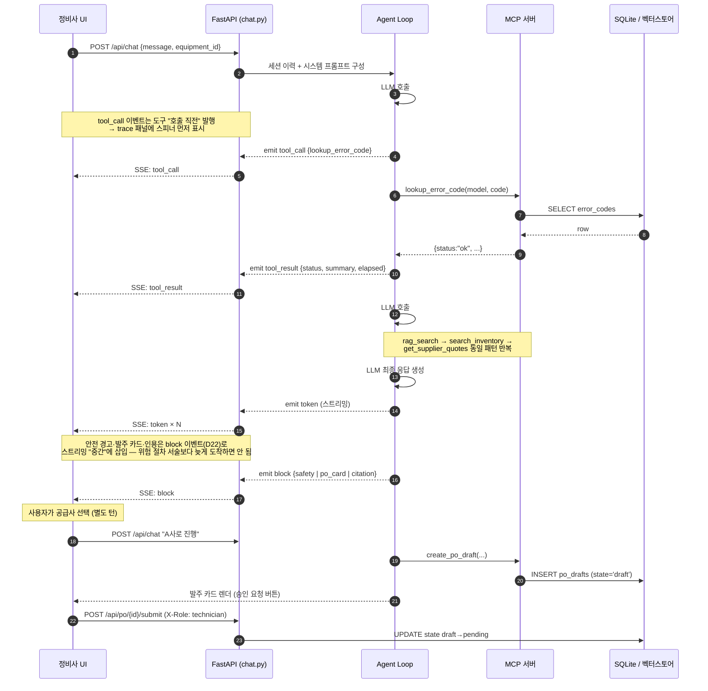

# 시스템 아키텍처 v0.1 — 동적 흐름·루프 정책·장애 모드

정적 구조는 `06_REPO_API.md` 참조. 이 문서는 "움직일 때 어떻게 되는가"만 다룬다.
스코프 원칙: 목업 DB·단일 사용자 데모 기준. 스케일링/HA/분산은 의도적으로 다루지 않음 (규모에 맞는 설계).

---

## 1. 시퀀스 다이어그램 (S1 기준)



**구현 시 헷갈리는 지점, 여기서 확정 (A1~A8):**

| 결정 | 내용 |
|---|---|
| A1 | `tool_call` 이벤트는 도구 호출 **직전** 발행 (직후 아님) — trace 패널이 "실행 중" 상태를 보여줄 수 있어야 함 |
| A2 | `create_po_draft`는 견적 제시 턴에서 자동 호출하지 않음 — 사용자의 공급사 선택 발화가 있는 **다음 턴**에서 호출 (도구 description에도 명시돼 있음) |
| A3 | draft→pending 전이는 채팅 밖 REST(`/submit`) — 에이전트 루프는 이 전이에 관여하지 않음 |
| A4 | 안전 경고·발주 카드·인용은 `block` 이벤트(D22)로 전달, **스트리밍 중간 삽입 가능** — 안전 경고는 해당 절차 서술 시작 전/과 함께 도착해야 함. token에 섞어 텍스트로 흘리지 않음 |
| A5 | 모든 tool_call/tool_result/block은 SSE 발행과 동시에 `traces` 테이블에 저장 (D21) — SSE 끊김 폴백·화면 B 링크·평가 판정의 단일 소스 |
| A6 | MOQ 미달 발주는 도구가 `status:"error"`(`reason:"moq_not_met"`)로 거부 (D31) — 에이전트는 수량을 임의로 올리지 말고 사용자에게 재확인. 견적 제시 턴에서 미리 고지하는 게 1차 방어 |
| A7 | 에러 이력 기록(`POST /api/equipment/{id}/errors`)은 **에이전트 루프 밖**의 사용자 액션 (D29) — A3(draft→pending)과 같은 성격. 루프가 자동 호출하면 `repeated` 판정이 질문 횟수로 오염됨 |
| A8 | S3 발주 보류는 `po_card` block 의 **variant: `hold`** 로 전달 (D35) — 새 이벤트 타입을 만들지 않고, token 텍스트로도 흘리지 않는다 |

## 2. 에이전트 루프 정책

```python
# agent/loop.py 의사코드
MAX_TOOL_CALLS_PER_TURN = 8      # 초과 시: 지금까지 결과로 응답 생성 + "추가 확인 필요" 명시
MAX_LLM_CALLS_PER_TURN  = 10     # 도구 없는 공회전 포함 상한
TOOL_TIMEOUT_SEC        = 10     # 개별 도구 타임아웃
```

- **종료 조건**: LLM이 도구 호출 없이 텍스트만 반환하면 그 턴 종료
- **루프 탈출**: 동일 도구를 동일 입력으로 2회 연속 호출하면 강제 중단 → "반복 호출 감지" 로그 + 현재 정보로 응답
- **세션 이력**: 세션당 최근 20 메시지 유지 (초과분은 앞에서 절삭). 도구 결과는 **원본 dict 를 `role:"tool"` 메시지로 구조 보존**해 남긴다 (D76). 필드 선별은 **블랙리스트** — 기본 전부 보존, 부피 큰 필드(`chunks[].text` 등)만 절삭한다. ~~발주 식별 필드 화이트리스트(`PRESERVE_FIELDS`)~~ 는 D76 으로 제거됐다 — 화이트리스트는 "빠뜨리면 환각"이라 도구 수에 비례해 위험이 커졌고, 2026-08-05 부품 특정 0/15 가 그 구조에서 났다. A2 에 따라 `create_po_draft` 가 **다음 턴**에 호출되므로 값 보존이 여전히 전제다
- **컨텍스트 주입**: 매 턴 equipment_id로 equipment 테이블 조회 → 시스템 프롬프트에 model 주입 (사용자가 모델을 안 밝혀도 enum 파라미터 채움)
- **비용 가드**: 세션당 LLM 호출 50회 상한 → 초과 시 "새 세션을 시작해 주세요"

## 3. 장애 모드 → 사용자에게 보이는 것

| 장애 | 감지 | 사용자 표시 | trace 표시 |
|---|---|---|---|
| MCP 서버 다운 | 연결 실패/타임아웃 | "도구 서버에 연결할 수 없습니다. 재시도하거나 관리자에게 문의하세요" — **추측으로 답변 이어가지 않음** | 스텝 ✗ error (붉은 점) |
| 개별 도구 타임아웃(10s) | asyncio timeout | 해당 정보만 "확인 실패"로 명시하고 나머지 결과로 응답 | ✗ timeout |
| LLM API 오류/타임아웃 | SDK 예외 | "응답 생성에 실패했습니다" + 재시도 버튼. 부분 스트림은 폐기 | — |
| DB 잠금/오류 | sqlite 예외 | 도구가 status:"error" 반환 → 에이전트가 자연어로 안내 | ✗ error |
| SSE 연결 끊김 | 클라이언트 감지 | UI가 GET /trace로 폴백 조회 후 재연결 | 이어 붙임 |
| 미지 에러코드 | status:"not_found" | **장애 아님** — S4 정상 흐름 (A/S 안내) | ! not_found (주황 점 = `warn`) |

> **`not_found` 의 trace 색 정정 (Stage 3)** — 초안은 "✓ 파란 점"이었으나 구현 팔레트에서
> 파랑은 `ok`(성공)다. 분기와 성공을 같은 색으로 뭉개면 "매뉴얼에 없는 코드"가 화면에서
> **정상 조회처럼** 보인다. D44 의 5종은 `ok`(파랑) / `warn`(주황, **분기**) /
> `pending` / `held` / `error`(적색, **장애**) 이고 `not_found`·`empty` 는 `warn` 이다.
> 구현(`frontend/lib/trace.ts`)이 맞고 이 표가 틀렸었다.

**원칙: 도구 실패 시 에이전트는 그 공백을 지식으로 메우지 않는다.** 실패한 조회는 실패했다고 말한다 (환각률 0% 지표는 장애 상황에도 적용).

이 원칙은 "MCP 서버 다운"에도 적용된다. 백엔드는 기동 실패해도 앱을 죽이지 않고
`McpClient` 객체를 `ready=False` 로 남기므로(승인 큐는 살아야 한다), 라우터의 가드는
**객체 존재가 아니라 `ready` 를 본다** — 존재만 확인하면 도구 목록이 빈 채로 LLM 이
근거 없이 진단을 서술하는 경로가 열린다 (`backend/routers/chat.py`, 회귀 `sp3 ⑲`).

## 4. 개발 전 기술 스파이크 (문서 아님, 코드로 검증)

| # | 스파이크 | 검증 질문 | 예상 |
|---|---|---|---|
| SP1 | 매뉴얼 표 5페이지 pdfplumber 추출 | 셀 병합·줄바꿈에서 정확도 몇 %? 파서로 충분한가? | **완료 (D24)** — 텍스트 파싱으로 충분, 64건 추출 |
| SP2 | MCP 서버 ↔ 에이전트 hello-world 왕복 | 도구 등록·호출·status 반환 왕복 확인 | **통과 (15건)** — `spikes/sp2_mcp_roundtrip.py` |
| SP3 | FastAPI SSE 이벤트 4종 스트리밍 (D22) | token/tool_call/tool_result/block이 프론트에서 구분 수신되고, block이 token 스트림 "중간"에 삽입 가능한가 | **통과 (11건)** — `spikes/sp3_sse_events.py`. 진행 중 D23의 구현 불가 결함 발견 → **D36** |

SP1 결과에 따라 M1 일정 확정. 셋 다 통과하면 M2에서 막힐 미지수 없음.

**셋 다 통과 (2026-07-23).** 스파이크는 재실행 가능한 회귀 테스트로 `spikes/` 에 남긴다 —
계약(이벤트 4종·status 반환·A1 순서·block 중간 삽입)이 깨지면 여기서 먼저 잡힌다.
SP3 는 실제로 `X-User: 김OO` 가 HTTP 헤더로 전송 불가임을 잡아냈다 (→ D36).
